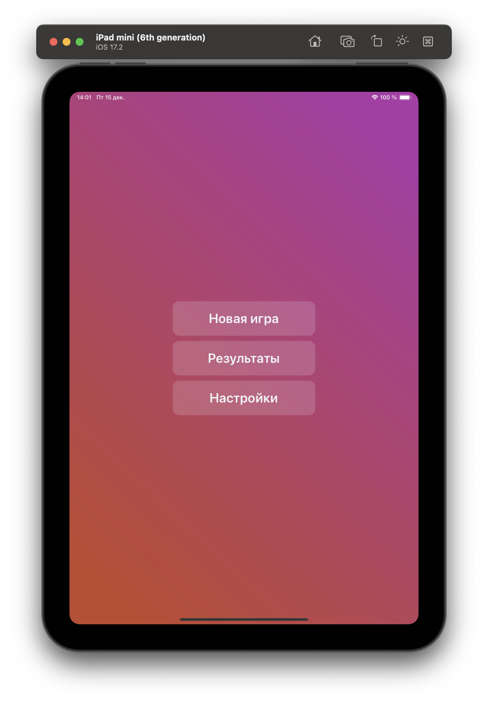
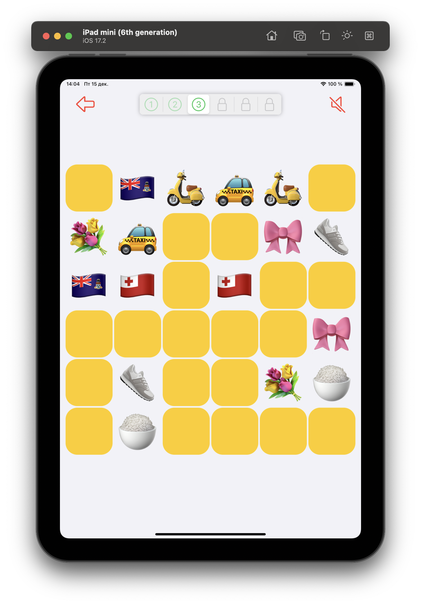
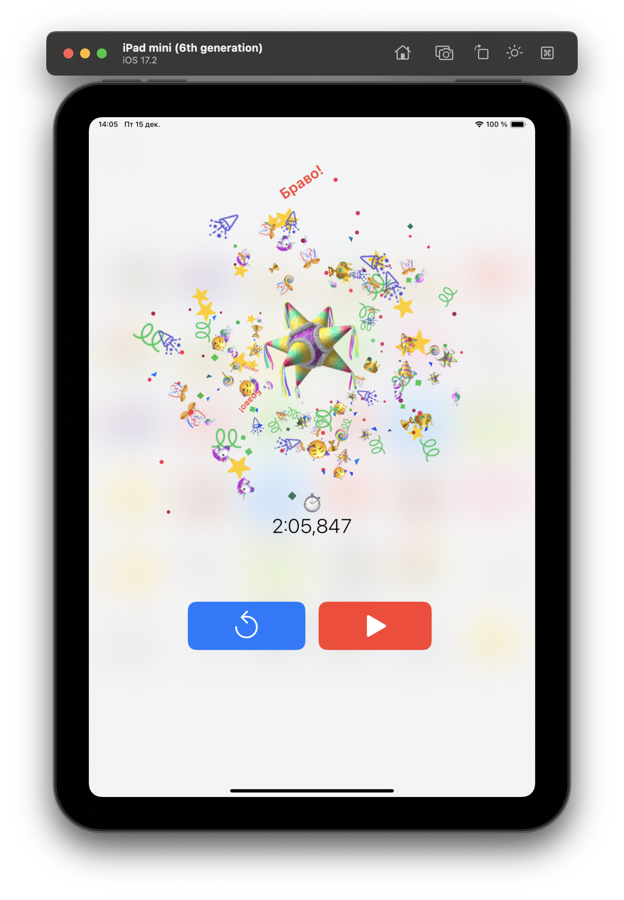
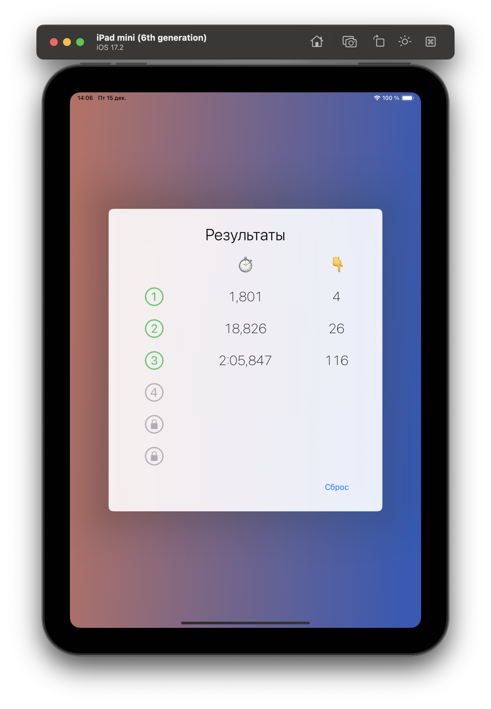
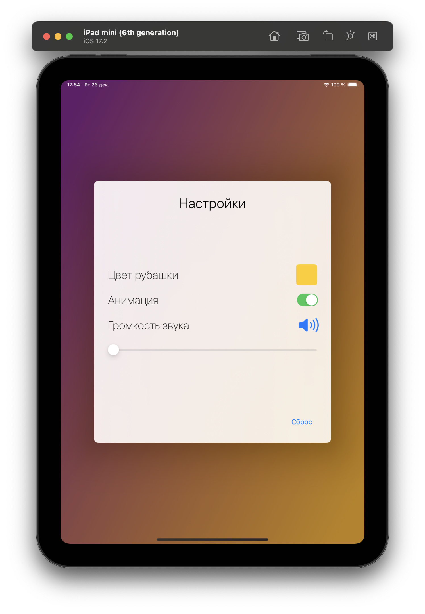

# Emoji Matching Game

Привет! Emoji Matching Game — увлекательная игра для iPad, где ваша задача найти пары для emoji на игровом поле.

## Как играть

1. На игровое поле вы увидите перевернутые карточки.
2. Поворачивайте карточки, нажимая на них, чтобы найти пару.
3. Если две открытые карточки содержат разные Emoji, они перевернутся обратно.
4. Если Emoji на карточках совпадают, они останутся открытыми.
5. Открывайте карточки, пока не найдете все пары.

## Уровни

Игра включает разные уровни с разным количеством карточек. Испытайте свои навыки на различных уровнях сложности.

## Как запустить

Пока что игра не добавлена в AppStore, но вы сможите запустить ее у себя в симуляторе

1. Клонируйте репозиторий: `git clone hhttps://github.com/Abduction-Lamp/EmojiMatchingGame`
2. Откройте проект: `EmojiMatchingGame.xcodeproj`
3. Выберите симулятор `iPad` с установленной версией `iOS 15` или новее
4. Запустите проект: Нажмите кнопку "Run" в Xcode или используйте горячие клавиши Cmd + R.

Теперь у вас должен успешно запуститься проект на симуляторе iPad! 🎉

## Демонстрация

|Главное меню|Ход игры|Анимация победы|
|:-:|:-:|:-:|
||||
|**Результаты**|**Настройки**||
|| |  |

## Анимация победы

## Планы на будущее

- **Локализация:**
  В планах добавить поддержку локализации на различные языки, чтобы сделать игру доступной для более широкой аудитории.

- **Тактильная обратная связь:**
  Планируется внедрить тактильную обратную связь для улучшения взаимодействия пользователя с игрой. Это может включать в себя вибрации, анимации или другие эффекты.

- **Работа со звуком:**
  В будущем мы планируем расширить возможности игры, добавив работу со звуком. Это включает в себя фоновую музыку, звуковые эффекты и настройки звука.

Я всегда открыты для предложений и идей. Если у вас есть какие-то функции, которые вы хотели бы видеть в игре, не стесняйтесь создать Issue или предложить Pull Request!

## Лицензия

Этот проект лицензирован под MIT License.